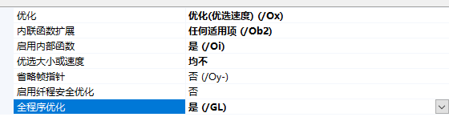

# Drivermain return STATUS_UNSUCCESSFUL

Put the code in NonPagedPool and fix  
copy from https://github.com/paradoxwastaken/Poseidon  
and https://bbs.pediy.com/thread-228353.htm  
  
# 注意事项  
全程序优化要开  
  
安全检查，控制流防护关了，这样不会生成无关紧要的Call  
  
  
  
  
生成出来的代码长这样  
  
特征码搜索0xDEADC0DE6666即可,找到后根据偏移修复  
